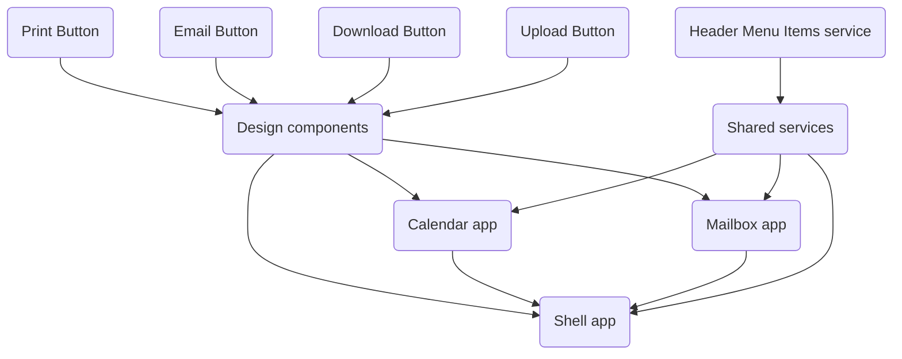

# Module Federation task

This project was generated with [Angular CLI](https://github.com/angular/angular-cli) version 18.0.5.

## Install instructions
1. Checkout repo
2. Ensure you have Node.JS 18.13.0 or higher installed
3. Run npm install
4. Start project with `npm start`

## Development server

Run `npm start` for a dev server. Navigate to `http://localhost:4200/`. The application will automatically reload if you change any of the source files.

## Code scaffolding

Run `ng generate component component-name` to generate a new component. You can also use `ng generate directive|pipe|service|class|guard|interface|enum|module`.

## Libraries used
- Angular latest version
- Native federation latest version
- RxJS
- Karma + Jasmine
- npm-run-all - to run all apps dev servers concurrently

## Brief explanation
Demo includes 3 standalone apps: Shell app, Mailbox App and Calendar App. Mailbox and Calendar apps exist on their own route, as well inside the shell app where they are displayed side by side in separate router outlets.

The apps accept a url parameter after their route and display the string inside their containers. So http://localhost:4200/shell/dummy will display both apps side by side and they will display `dummy`. This url param can be set with the input in the config section of the app. Any further navigation will update the data in the apps. Or you can simply edit the url in the browser which will also rerender the apps.

The next section is a header section, where the app will randomly display random amounts of header buttons. It simulates an API response with a schema of what items need to be displayed in the header menu. The components are part of the shared lib called design-components and the logic is handled by the shared service. All 3 apps have access to the lib and service. Inside the mailbox app there is also a button that will randomize the header buttons components list as well.

